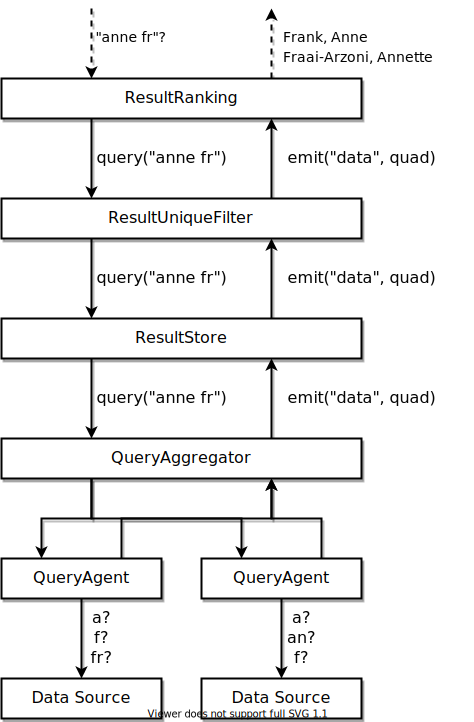

# Termennetwerk Autocompletion Client

Imagine a jQuery-style autocompletion widget without hardcoded options, which can scale to millions of values. This project contains a proof of concept of such a client, and is structured as a toolbox to build your own clients.

## Installation

```npm i @hdelva/termennetwerk_client```

## Require

```import AutoComplete from "@hdelva/termennetwerk_client";```

### Using one of the preconfigured clients

```javascript
import AutoComplete from "@hdelva/termennetwerk_client";
import * as RdfString from "rdf-string";

// creates a client that traverses 4 datasets for the 10 best results
const client = new AutoComplete.examples.StrictAutoComplete([
    "https://termen.opoi.org/nta",
    "https://termen.opoi.org/vtmk",
    "https://termen.opoi.org/cht",
    "https://termen.opoi.org/rkdartists"
], 10);

client.on("data", (quad) => {
    console.log(quad.subject.value);
})

client.on("reset", () => {
    console.clear();
})

client.on("end", () => {
    //
})
```

## Build your own

```javascript
import { similarityFunctions, components } from "@hdelva/termennetwerk_client";

function relationSimilarity(expected, found) {
    return similarityFunctions.tokenwiseCompare(
        similarityFunctions.fuzzyIndexSimilarity,
        expected,
        found,
    );
}

function relationFilter(_, __, similarity) {
    return similarity > 0.9;
}

function resultSimilarity(expected, found) {
    return similarityFunctions.tokenwiseCompare(
        similarityFunctions.asymmetricDiceCoefficient,
        expected,
        found,
    );
}

function lengthResult(_, found) {
    return -1 * found.length;
}

const resultConfigurations = [
    new components.SimilarityConfiguration(resultSimilarity),
    new components.SimilarityConfiguration(lengthResult),
]

const relationConfigurations = [
    new components.SimilarityConfiguration(relationSimilarity, relationFilter),
]

export default class FuzzyAutoComplete extends components.ResultEmitter {
    constructor(sources, size) {
        super();

        const agents = [];
        for (const source of sources) {
            agents.push(new components.QueryAgent(source, relationConfigurations));
        }

        const aggregator = new components.QueryAggregator(agents);
        const store = new components.ResultStore(aggregator);
        const filter = new components.ResultUniqueFilter(store);

        const sorted = new components.ResultRanking(
            size,
            filter,
            new components.NFKD(),
            resultConfigurations
        );
        this.subEmitter = sorted;

        this.subEmitter.on("data", (data) => this.emit("data", data));
        this.subEmitter.on("end", (data) => this.emit("end", data));
        this.subEmitter.on("reset", () => this.emit("reset"));
    }

    query(input) {
        this.subEmitter.query(input);
    }

    resolveSubject(uri) {
        return this.subEmitter.resolveSubject(uri);
    }
}
```

## Structure

An autocompletion client is a combination of multiple components which all implement the same interface. Currently, these components are implemented:

* `QueryAgent`: used to traverse a single data source, looking for the requested query string 
* `QueryAggregator`: merges the results from several other components
* `ResultRanking`: creates a top-n view of all discovered results
* `ResultStore`: maintains an in-memory RDF graph to provide additional context for the results
* `ResultUniqueFilter`: filters out duplicate results

Each component exposes two methods:`query` and `resolveSubject`. The `query` method does not return anything, instead it starts a sequence of asynchronous calls that will emit `data` events each time a relevant `Quad` is found. Optionally, all known information about a certain subject can be requested (by the subject's URI), in which case the components should return all known quads related to this subject.

Two components can be configured with sorting functions: `QueryAgent` and `ResultRanking`. The former uses the functions to determine the node traversal order, the second one uses them to sort the results. Optionally, an additional filter function can be added to these sorting functions, which sets a minimum similarity score for a relation/result to be considered useful. 

The following image illustrates how the components are used in the preconfigured client:



Not shown in the image above are the additional optional `resolveSubject` calls, which are passed through to, and handled by, the `ResultStore`. 